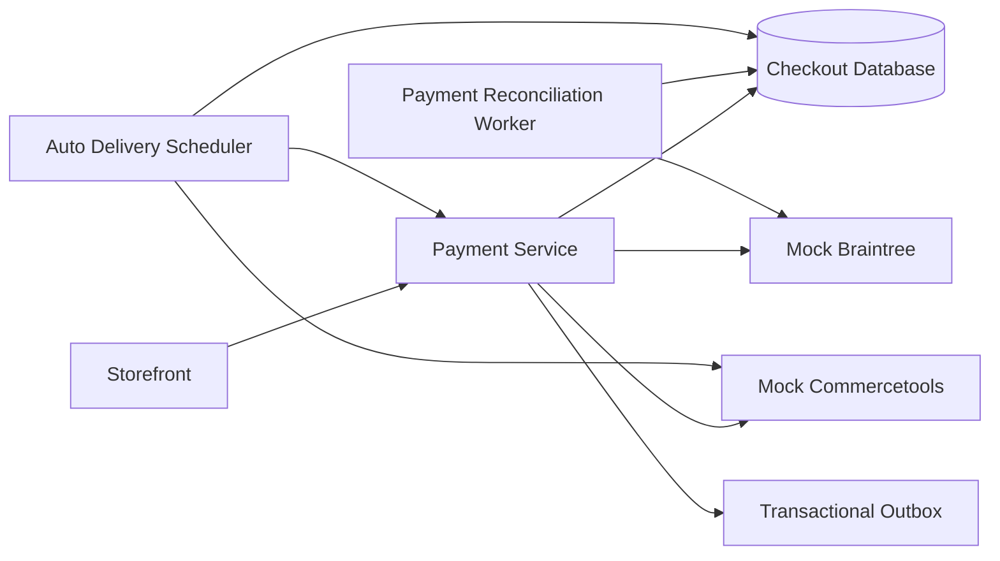
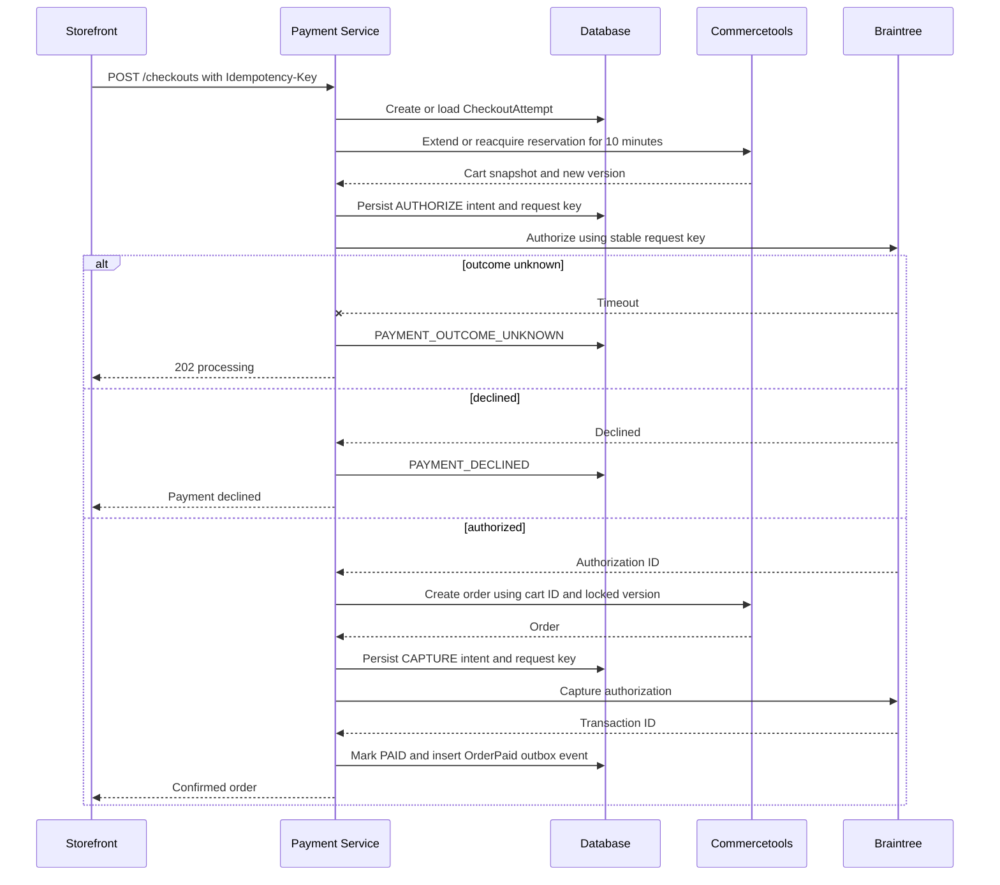

# Ecommerce Payment Service Architecture

## Purpose

This service demonstrates a production-oriented ecommerce checkout for one-off purchases and consented auto-delivery orders. Commercetools owns carts, prices, postcode inventory, ten-minute `ReserveOnCart` reservations, and orders. Braintree owns payment authorization, capture, void, and refund operations. Both are represented by deterministic local mocks so failure scenarios are repeatable.

## System context

## Checkout sequence

## Double-charge prevention

The design uses several identifiers because no single identifier covers every failure mode.

| Identifier | Responsibility |
| --- | --- |
| Checkout ID | Durable orchestration identity |
| HTTP `Idempotency-Key` | Deduplicate client retries |
| Cart ID and version | Prevent two orders from one immutable cart snapshot |
| Session ID | Trace context only; never the payment uniqueness boundary |
| Braintree request key | Deduplicate authorization, capture, void, and refund operations |
| Order number | Recover uncertain commercetools order creation |
| Subscription ID and scheduled date | Deduplicate auto-delivery occurrences |

The request hash is stored with the idempotency key. Reusing the same key with different input is rejected. Payment intent is committed before contacting Braintree. Recovery always reuses the original gateway key.

## Unknown payment outcomes

A network timeout is not a decline. The checkout moves to `PAYMENT_OUTCOME_UNKNOWN`, and the fast reconciliation worker checks every 30 seconds for six attempts. If the result is still unknown, the checkout becomes `REQUIRES_REVIEW`; it is never classified as failed merely because polling ended. The storefront receives a durable checkout ID and can retrieve the result after the browser is closed.

## Stock and price integrity

Commercetools carts use `ReserveOnCart` with a ten-minute expiration. Pressing Pay extends or reacquires reservations before payment starts. Any reservation warning stops checkout before Braintree is called. The returned cart version and priced total form the locked checkout snapshot. A changed cart version or total requires new customer confirmation.

## Crash recovery and event delivery

Payment and refund operations are written before external calls and have unique request keys. After discovering a completed capture, the payment state and `OrderPaid` outbox event are committed in one database transaction. Outbox delivery is at least once. Consumers must deduplicate by `eventId`, providing an exactly-once business effect rather than claiming exactly-once transport.

## Auto delivery

The daily scheduler discovers due subscriptions and inserts occurrences with a database constraint on `(subscription_id, scheduled_for)`. Rescanning is safe because existing occurrences are not reset or recreated. Workers claim individual occurrences with leases and resume from their persisted state.

Each occurrence reprices its cart, reserves current stock, and uses a deterministic payment key. An unavailable product creates a substitution proposal. The replacement is applied only after explicit customer consent; otherwise the item is removed from that occurrence without silently changing the permanent subscription.

## Retention

Occurrence rows are thin operational and audit records. Active and unresolved rows are never automatically deleted. Completed occurrences remain in the primary database for a configurable hot-retention period, then move to monthly archive partitions. Payment and refund retention is governed separately. Published outbox rows and expired worker leases have shorter cleanup windows.

## Important failure scenarios

| Scenario | Response |
| --- | --- |
| Reservation expired | Reacquire before payment; return affected SKUs if unavailable |
| Cart changed in another tab | Reject stale version and require review of the new total |
| Authorization timed out | Mark outcome unknown and reconcile using the same request key |
| Order creation fails after authorization | Void authorization and release or expire reservation |
| Capture succeeds before service crash | Recover the existing transaction with the stable capture key |
| Outbox publish repeats | Consumers deduplicate the stable event ID |
| Auto-delivery scan restarts | Unique occurrence key makes rescanning safe |
| Replacement has no consent | Remove or skip the item for that occurrence |

